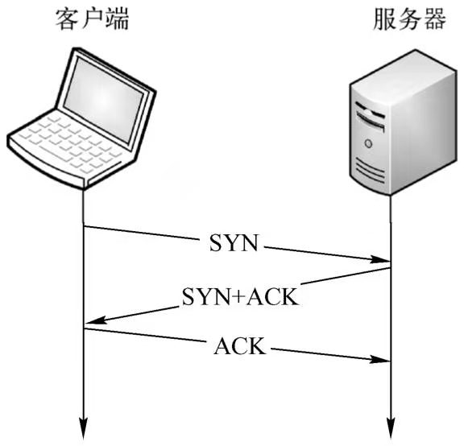
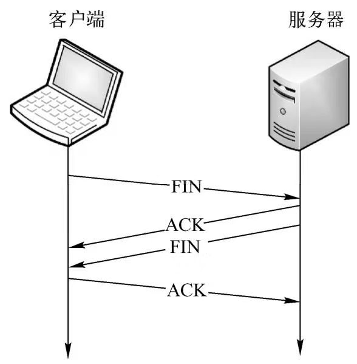

##### 1、计算机网络分为哪几层

```
第一层：物理层:管理最基础的传输通道,简历物理间接,并提供物理链路所需的机械、电气、功能和过程等特性
第二层：数据链路层:将数据分割成帧,并负责MAC寻址、差错检验和信息纠正,以太网属于这一层
第三层：网络层:负责地址管理、路由选择和拥塞控制,该层最知名的是IP协议
第四层：传输层:为数据提供可靠的或不可靠的端到端传输,同时传输错误,控制流量,TCP和UDP就属于该层
第五层：会话层:负责建立,管理管理和断开通信连接,实现数据同步
第六层：表示层:负责数据的格式转换,加密与解密,压缩与解压
第七层：应用层:为应用程序提供服务并管理应用程序之间的通信,常用的协议有SMTP,FTP,HTTP等
```
##### 2、从输入url地址到服务器响应过程中发生了什么

```
（1）域名解析，根据域名找到服务器的IP地址。
（2）建立TCP连接，浏览器与服务器经过3次握手后建立连接。
（3）浏览器发起HTTP请求，获取想要的资源。
（4）服务器响应HTTP请求，返回指定的资源。
（5）浏览器渲染页面，解析接收到的HTML、CSS和JavaScript文件。
（6）连接结束
```
##### 3、get和post的区别

```
可见性  get方式传递的参数是跟着url地址后面的；post传递的参数是不可见的
传递数据量大小  get有限制，一般在2000字符左右；post无限制
安全性  相比get来讲post更安全
GET方式需要使用Request.QueryString来取得变量的值，而POST方式通过Request.Form来获取变量的值
```
##### 4、TCP的三次握手和四次挥手

```
三次握手：
（1）客户端发送一个携带SYN标志位的包，请求建立连接。
（2）服务器响应一个携带SYN和ACK标志位的包，同意建立连接。
（3）客户端再发送一个携带ACK标志位的包，表示连接成功，开始进行数据传输。
```



```
四次挥手：
（1）客户端发送一个携带FIN标志位的包，请求断开连接。
（2）服务器响应一个携带ACK标志位的包，同意客户端断开连接。
（3）服务器再发送一个携带FIN标志位的包，请求断开连接。
（4）客户端最后发送一个携带ACK标志位的包，同意服务器断开连接。
```


##### 5、什么叫传输控制(TCP)协议

```
传输控制协议（Transmission Control Protocol）是一种面向连接的、可靠的、基于字节流的传输层通信协议
旨在适应支持多网络应用的分层协议层次结构。 连接到不同但互连的计算机通信网络的主计算机中的成对进程之间
依靠TCP提供可靠的通信服务
```
##### 6、简单说一下HTTP

```
http是一个简单的请求-响应协议，它通常运行在TCP之上。它指定了客户端可能发送给服务器什么样的消息以及得到什么样的响应。请求和响应消息的头以ASCII码形式给出；而消息内容则具有一个类似MIME的格式.
http状态码:
    1×× 通知
    2×× 成功
    3×× 重定向
    4×× 客户端错误
    5×× 服务端错误

```
##### 7、说一下HTTPS
```
HTTPS（HTTP Secure）是一种构建在SSL或TLS上的HTTP协议,简单地说，HTTPS就是HTTP的安全版本。
为什么说HTTP不安全:
    （1）数据以明文传递，有被窃听的风险。
    （2）接收到的报文无法证明是发送时的报文，不能保障完整性，因此报文有被篡改的风险。
    （3）不验证通信两端的身份，请求或响应有被伪造的风险。

```